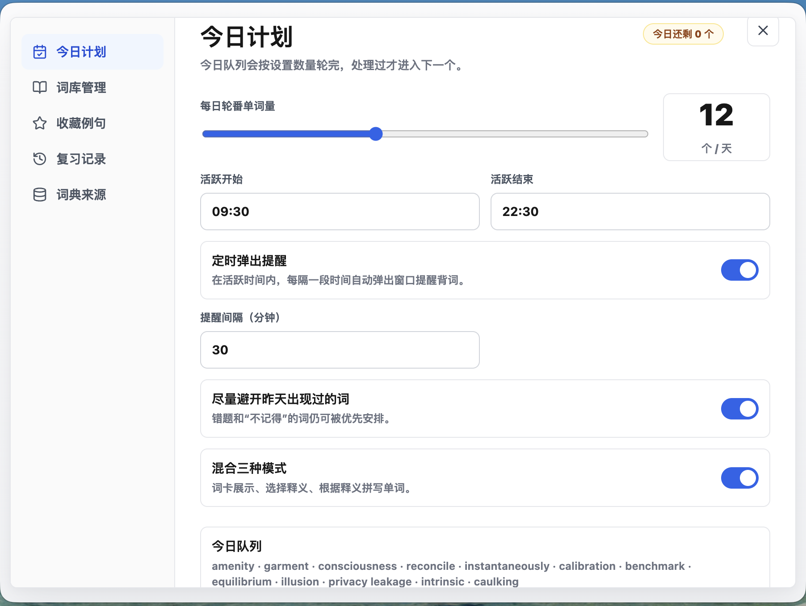
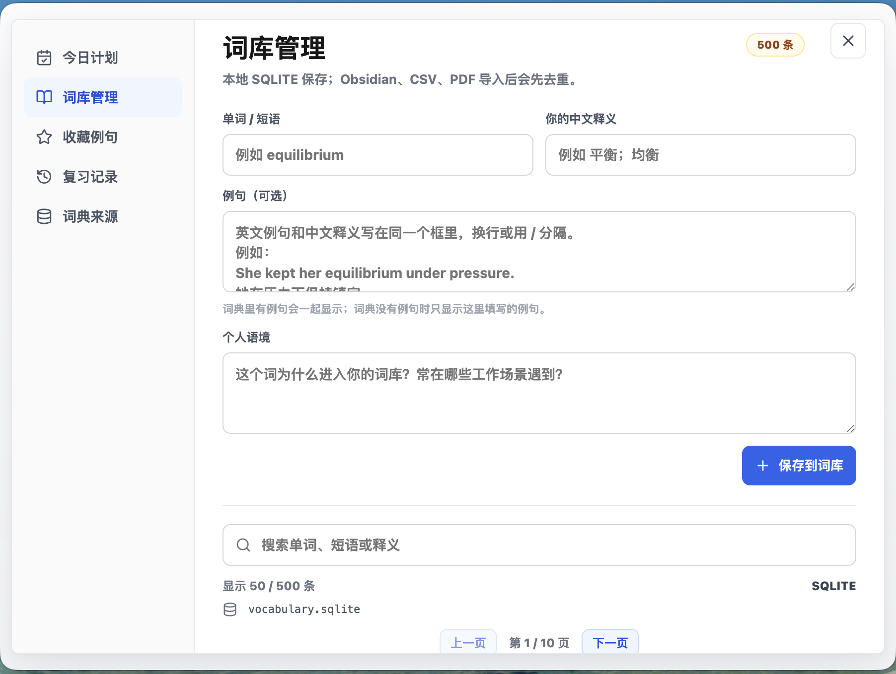
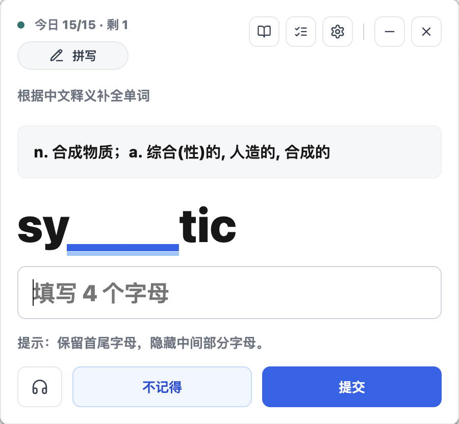
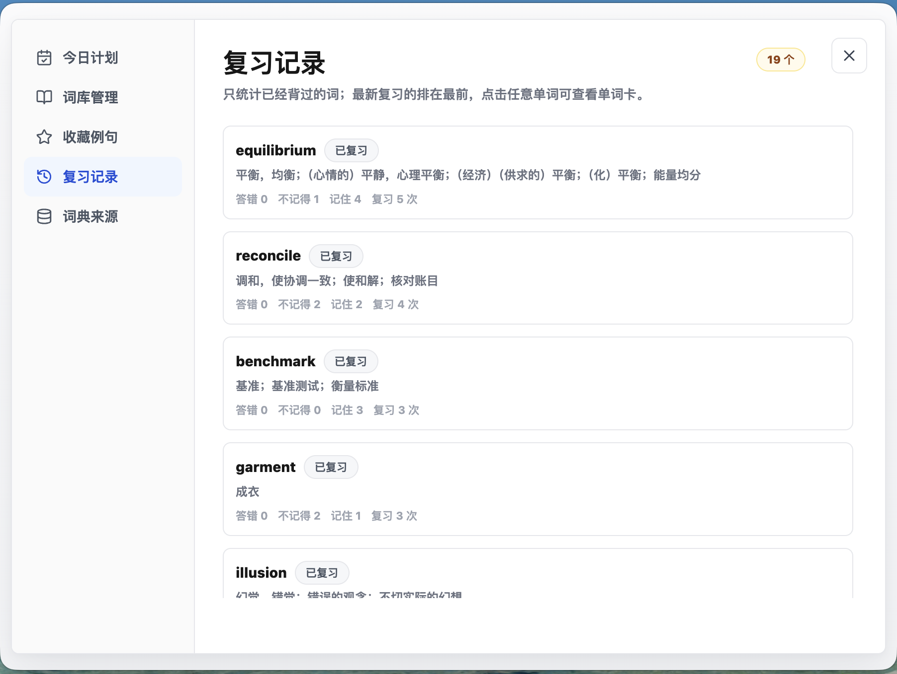
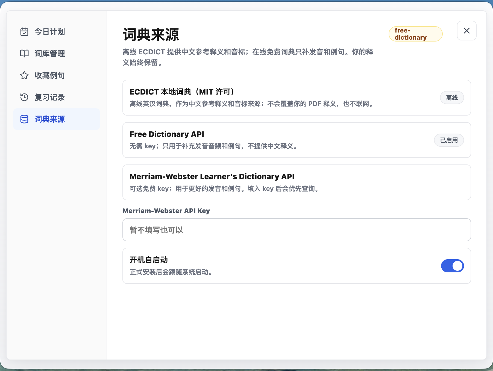
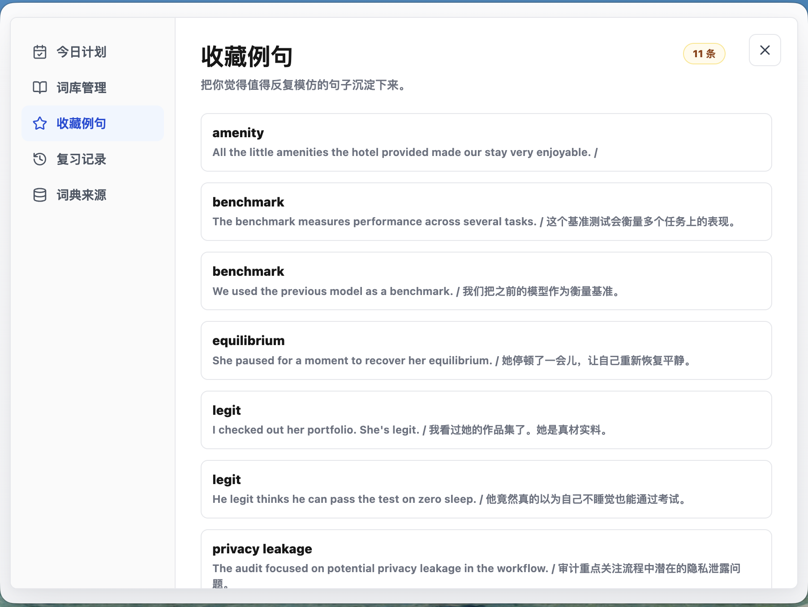
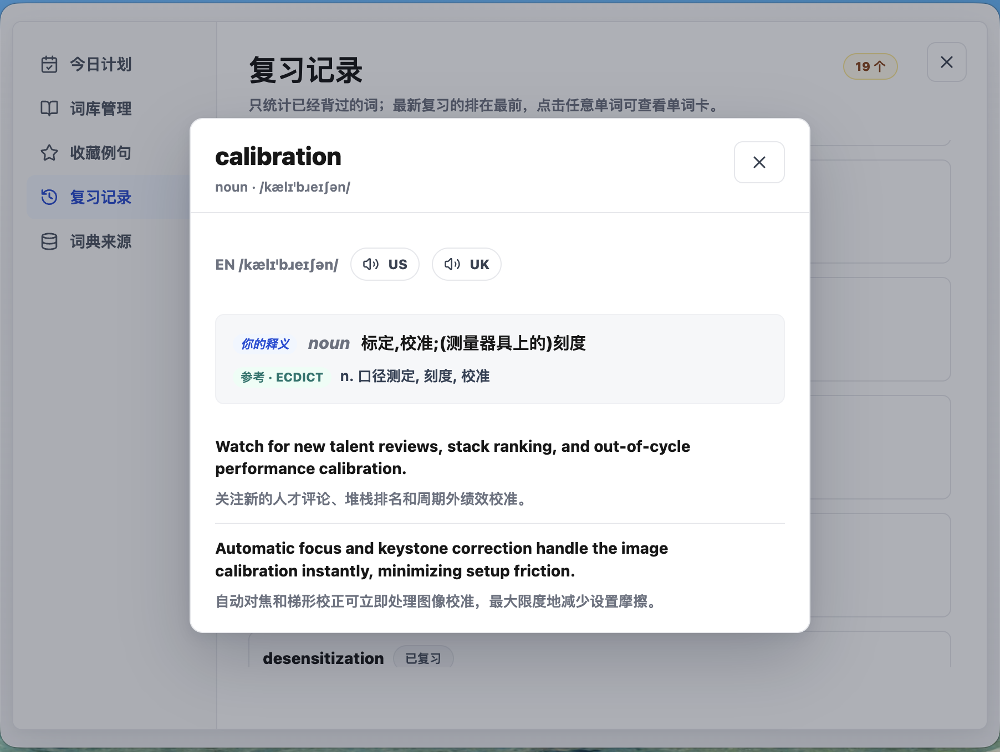
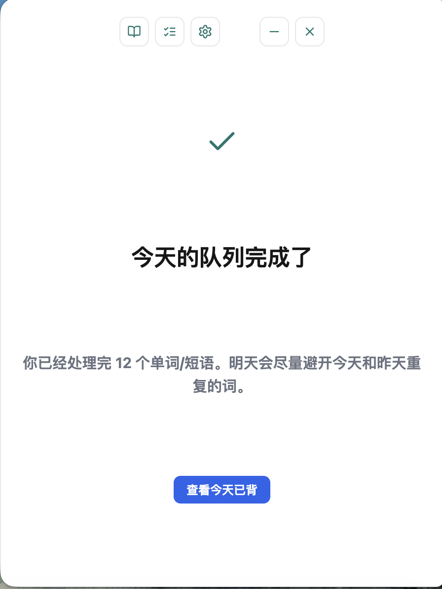
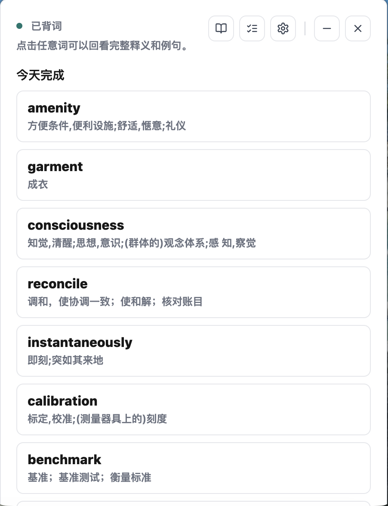

# Gleaner

**把你平时真实遇到、亲手收集的英文词汇，变成每天可复习、可追踪、可长期记住的个人词库。**

Gleaner 是一个为英文深度阅读者做的 **personal vocabulary retention tool**。它面向那些已经在真实阅读、工作、学习中持续遇到生词，也有主动收集习惯，但收集完之后复习不起来的人。

典型场景是这样的：

> 读英文内容 → 遇到生词 → 当时查了 → 觉得应该记住 → 存到某处 → 之后再也没看 → 下次又遇到又忘了。

这个应用要解决的就是最后那一步：让用户持续把自己遇到的词转化为长期记忆。它会把你的个人词库本地保存起来，结合离线词典和在线 API 自动补全音标、发音和例句，再通过每日抽词、词卡、选择题、拼写题和遗忘曲线复习，把“我应该记住它”变成真正可追踪的记忆过程。

核心优势：

- **Personal vocabulary database**: 词源来自你真实遇到、亲手收集的语境，不是随机背别人的词表。
- **Private and local-first**: 本地 SQLite 保存，无账号，无社交压力，不把个人词库交给云端服务。
- **Review, not just collect**: 数据库管理、API 补全、离线词典、例句编辑、每日抽词、选择题、拼写题、单词卡、遗忘曲线复习都围绕“长期记住”设计。

In short: Gleaner turns personally collected English words and phrases into a private, daily, trackable review system.

## Problem

Generic vocabulary apps usually start from someone else's word list. That is useful for exams, but less useful for long-term reading and work. The words that matter most are often the ones you personally encountered in papers, docs, meetings, product work, legal text, research, or daily reading.

This app is designed around that personal workflow:

- You collect words because they appeared in your real context.
- The app preserves your own meaning, notes, and examples.
- Offline dictionary data adds a clean reference meaning and phonetic.
- Online APIs can enrich pronunciation audio and examples.
- A daily queue uses a spaced-review algorithm so the words come back before they disappear from memory.

## Product Positioning

Gleaner is a **personal vocabulary retention tool**.

It is not a social learning app, not a generic word-of-the-day feed, and not a cloud vocabulary service. It is private, local-first, no-account, and low-pressure.

The advantage is not that it has the biggest dictionary. The advantage is that it helps you form a personal vocabulary knowledge base from the words you actually care about.

## Features

- **Compact desktop popup**: a small frameless Electron window intended to live near the bottom-right of the desktop.
- **Daily queue**: defaults to 5 words per day; configurable in settings.
- **Three review modes**:
  - word card
  - multiple-choice meaning quiz
  - spelling quiz with partial-letter hint
- **Memory-aware scheduling**: success increases the interval; wrong or forgotten answers bring the word back quickly.
- **Avoid yesterday when possible**: daily planning prefers words that did not appear yesterday, while still allowing due reviews to return.
- **Database management**: search, paginate, preview, edit, delete, and enrich entries.
- **Manual examples**: add examples when creating or editing a word.
- **Example favorites**: star useful example sentences for later reuse.
- **Offline dictionary**: bundled ECDICT SQLite database for Chinese reference meanings and phonetics.
- **Online enrichment**: optional Merriam-Webster API key, otherwise Free Dictionary API.
- **Fallback pronunciation**: if dictionary audio is missing, the app uses system text-to-speech for US/UK playback.
- **Local-first storage**: SQLite by default, JSON fallback if SQLite is unavailable.
- **No account**: data stays on the user's machine.
- **Autostart and reminders**: macOS login item support plus configurable reminder interval within active hours.

## Product Tour

The screenshots are grouped by workflow instead of stacked one by one: plan the day, manage the database, review words, and keep useful material coming back.

### Plan And Database

<table>
  <tr>
    <td width="50%">
      <strong>Daily plan</strong><br/>
      Set daily word count, active hours, reminder interval, and mixed review modes.
      <br/><br/>
      
    </td>
    <td width="50%">
      <strong>Vocabulary database</strong><br/>
      Add words, keep personal meanings and examples, search SQLite, and retry enrichment.
      <br/><br/>
      
    </td>
  </tr>
</table>

### Review Experience

<table>
  <tr>
    <td width="33%">
      <strong>Word card</strong><br/>
      Full meaning, phonetics, US/UK playback, examples, tags, and favorite examples.
      <br/><br/>
      
    </td>
    <td width="33%">
      <strong>Choice quiz</strong><br/>
      Pick the correct meaning from four options, with pronunciation available in quiz mode.
      <br/><br/>
      
    </td>
    <td width="33%">
      <strong>Spelling quiz</strong><br/>
      Reconstruct the word from a Chinese meaning and partial-letter hint.
      <br/><br/>
      
    </td>
  </tr>
</table>

### Retention And Sources

<table>
  <tr>
    <td width="50%">
      <strong>Review history</strong><br/>
      Track remembered, forgotten, and wrong counts; open any reviewed word as a full card.
      <br/><br/>
      
    </td>
    <td width="50%">
      <strong>Dictionary sources</strong><br/>
      ECDICT provides offline Chinese reference meanings and phonetics; online APIs add audio and examples.
      <br/><br/>
      
    </td>
  </tr>
  <tr>
    <td width="50%">
      <strong>Favorite examples</strong><br/>
      Keep the sentences worth imitating, especially the ones from your own reading or work context.
      <br/><br/>
      
    </td>
    <td width="50%">
      <strong>Word detail modal</strong><br/>
      Compare your meaning with the offline reference, replay pronunciation, and review examples in context.
      <br/><br/>
      
    </td>
  </tr>
</table>

### Completion Flow

<table>
  <tr>
    <td width="50%">
      
    </td>
    <td width="50%">
      
    </td>
  </tr>
</table>

## Architecture

The app is an Electron + React desktop application.

```text
vocab-desktop/
  app/
    main/
      main.js              Electron main process, window/tray/autostart/reminders
      dataStore.js         persistence layer and app-domain operations
      scheduling.js        pure scheduling and spaced-review helpers
      dictionary.js        offline + online dictionary enrichment pipeline
      ecdict.js            read-only offline ECDICT lookup
      seedEntries.js       initial vocabulary seed merge
      importedVocabulary.json
      data/ecdict.sqlite   bundled offline dictionary
    preload/
      preload.js           safe IPC bridge exposed as window.vocabApi
    renderer/
      main.jsx             React UI and interaction state
      styles/app.css       desktop card/settings styling
  scripts/
    dev.mjs
    import_vocabulary_pdf.py
    build_ecdict.py
    apply_ecdict_reference.py
    refresh_ecdict.mjs
```

Runtime flow:

1. Electron starts `app/main/main.js`.
2. `DataStore` opens local SQLite storage under the app data directory.
3. Missing seed entries from `importedVocabulary.json` are inserted without overwriting existing user edits.
4. ECDICT reference meanings and missing phonetics are backfilled once through versioned metadata.
5. `getState()` creates or reuses today's session.
6. React renders only the current study entries, a small distractor set, and paginated library data.
7. User actions call IPC methods through `window.vocabApi`.

## Data Model

The primary storage is SQLite. The app can fall back to JSON, but the SQLite path is the intended production path, especially for large libraries.

SQLite tables:

| Table | Purpose |
| --- | --- |
| `meta` | settings and migration/version markers |
| `entries` | vocabulary entries, stored as JSON payload plus indexed scheduling columns |
| `sessions` | daily queues and completion state |
| `reviews` | append-only review events |

The `entries` table stores the full entry as JSON in `payload`, and also denormalizes the fields needed for fast scheduling:

| Column | Why it exists |
| --- | --- |
| `id` | stable primary key |
| `term` | unique normalized word/phrase |
| `payload` | full entry object |
| `seen_count` | fast unseen/reviewed filtering |
| `next_review_date` | fast due-review filtering |
| `status` | exclude archived entries and count pending/review states |

Indexes:

```sql
CREATE INDEX IF NOT EXISTS idx_entries_status_seen ON entries(status, seen_count);
CREATE INDEX IF NOT EXISTS idx_entries_next_review ON entries(next_review_date);
CREATE INDEX IF NOT EXISTS idx_entries_term ON entries(term COLLATE NOCASE);
```

Entry payload fields include:

| Field | Meaning |
| --- | --- |
| `term` | word or phrase |
| `type` | `word` or `phrase` |
| `userMeaning` | the user's own meaning, imported from PDF or typed manually |
| `referenceMeaning` | clean offline reference meaning from ECDICT |
| `referenceSource` | currently `ECDICT` when available |
| `partOfSpeech` | part of speech from dictionary enrichment |
| `phonetics` | phonetic text and optional audio URLs |
| `examples` | dictionary and user examples |
| `notes` | personal context |
| `sourceRaw` | raw imported source text, useful for debugging PDF imports |
| `importWarnings` | parser warnings such as duplicate merge or missing Chinese meaning |
| `status` | `pending`, `needs-review`, `ready`, or `archived` |
| `dictionarySource` | source labels used during enrichment |
| `dictionaryLookupAttemptedAt` | prevents repeated automatic API calls |
| `lastQueuedAt`, `queuedCount` | daily queue fairness tracking |
| `lastSeenAt`, `nextReviewAt`, `intervalDays`, `ease` | spaced-review state |
| `seenCount`, `correctCount`, `wrongCount`, `forgottenCount` | review statistics |

### Word Status Updates

- New imported entries start as `pending` unless the PDF parser found suspicious structure.
- Parser warnings move an entry to `needs-review`.
- Dictionary enrichment also marks entries as `needs-review`, because automatic data should be checked by the user.
- Manual deletion removes the row and records the term in `meta.deletedTerms`, so seed data does not silently re-add it on the next launch.
- `archived` entries are excluded from scheduling, although the current UI uses delete rather than archive.

The app intentionally does **not** overwrite `userMeaning` during enrichment. Your own meaning is the primary personal record; ECDICT is stored separately as `referenceMeaning`.

## Dictionary Enrichment

Dictionary lookup is designed to be accurate enough to help, but conservative enough not to corrupt the user's personal database.

Priority:

1. **Offline ECDICT**
   - Local SQLite file at `app/main/data/ecdict.sqlite`.
   - Provides Chinese reference meaning and phonetic text.
   - Never uses the network.
   - Never overwrites `userMeaning`.

2. **Merriam-Webster Learner's Dictionary API**
   - Optional.
   - Used first online when `merriamWebsterKey` is configured.
   - Provides pronunciation data and examples.

3. **Free Dictionary API**
   - No key required.
   - Used as the default online fallback.
   - Provides pronunciation audio, phonetic text, English part of speech, and examples when available.

4. **System text-to-speech fallback**
   - If no dictionary audio exists, the card still plays `en-US` or `en-GB` through the system TTS engine.

Online sources are intentionally limited to pronunciation/audio/examples. The clean Chinese reference comes from ECDICT, while the user's meaning remains untouched.

### API Failure Fallback

If online lookup fails, times out, or returns no useful result:

- the entry remains in the database;
- ECDICT reference data is still used when available;
- `dictionaryLookupAttemptedAt` is set so the app does not keep retrying automatically;
- the user can press `补全` manually to retry;
- pronunciation still falls back to system TTS.

### Manual And Automatic Examples

Examples carry a `userAdded` flag.

When dictionary enrichment runs:

- user-added examples are always preserved;
- new dictionary examples replace previous dictionary examples;
- if the API returns no examples, existing dictionary examples remain;
- the study card displays up to three examples and keeps at least one user-added example visible when possible.

This prevents the app from hiding the exact sentence that made the word worth saving in the first place.

## Review Algorithm

The scheduling logic lives in `app/main/scheduling.js` and is pure enough to test without Electron.

Each reviewed entry has:

- `intervalDays`
- `ease`
- `nextReviewAt`
- `seenCount`
- `correctCount`
- `wrongCount`
- `forgottenCount`

Review results:

| Result | Used by |
| --- | --- |
| `remembered` | card mode, user says "I remember" |
| `forgotten` | card/quiz modes, user says "I don't remember" |
| `correct` | quiz answer is correct |
| `wrong` | quiz answer is wrong |

Interval update:

```js
// Failure: wrong or forgotten
intervalDays = 1
ease = max(1.35, ease - 0.28)
nextReviewAt = tomorrow

// Success: correct or remembered
intervalDays = intervalDays <= 0
  ? 2
  : min(90, max(2, round(intervalDays * ease)))
ease = min(2.8, ease + 0.08)
nextReviewAt = today + intervalDays
```

This is a lightweight spaced-repetition model inspired by forgetting-curve behavior:

- new words come back soon;
- successful reviews expand the interval;
- missed words are reset to tomorrow;
- ease is bounded so words do not disappear forever or collapse into noise.

## Daily Queue Planning

The daily session is stored in `sessions` by date. A session contains:

```js
{
  date,
  entryIds,
  completedIds,
  createdAt,
  updatedAt
}
```

Planning rules:

1. If today's session already exists and still matches `dailyGoal`, reuse it.
2. Preserve completed words when the daily goal changes.
3. Build a scheduling pool from non-archived entries.
4. Split candidates into:
   - due reviews
   - unseen words
   - future reviews
5. Reserve about 35% of the daily goal for due reviews:

```js
reviewSlots = min(dueReviews.length, max(1, floor(dailyGoal * 0.35)))
```

6. Fill the queue in phases:
   - primary due reviews
   - unseen words
   - remaining due reviews
   - future reviews, only if needed

7. Avoid yesterday's entries when possible, but use them as fallback if there are not enough candidates.

The scoring function combines:

- due-review boost;
- overdue boost;
- unseen-word boost;
- wrong/forgotten boost;
- old-seen boost;
- correct-count penalty;
- queued-count penalty for unseen words;
- yesterday penalty.

That means the app tries to cover the full vocabulary list, but still brings back words that are due or previously difficult.

## Performance At 10,000 Words

The code is designed so normal operations do not load and sort the whole library unnecessarily.

Key optimizations:

- SQLite instead of a plain JSON file when available.
- Denormalized scheduling columns in `entries`.
- Indexes on status/seen count, due date, and term.
- Daily scheduling queries cap candidate buckets:
  - unseen: 500
  - due: 400
  - future: 200
- `getState()` returns:
  - today's words;
  - a random distractor set for multiple choice;
  - not the entire 10,000-entry library.
- Library browsing is paginated at 50 entries per page.
- History browsing is paginated separately.
- Offline ECDICT lookup uses a read-only SQLite database and a prepared statement.

Expected behavior with 10,000 words:

- daily startup and queue planning should stay bounded by the scheduling caps;
- library search uses SQLite `LIKE` queries and pagination;
- choice distractors are limited to 100 random entries outside today's queue;
- the JSON fallback is useful for compatibility but SQLite is the intended large-library backend.

## Scheduling Correctness Tests

Run:

```bash
npm test
```

The tests in `app/main/scheduling.test.js` cover:

- first successful review gives a 2-day interval;
- repeated success grows the interval and caps at 90 days;
- failure resets the interval to 1 day and lowers ease to the configured floor;
- missing or past `nextReviewAt` values are due;
- future `nextReviewAt` values are not due;
- large scheduling pools are capped before planning;
- unseen words enter through the unseen phase when no due reviews exist;
- due review slots are about `floor(goal * 0.35)`;
- yesterday's words are avoided when enough alternatives exist;
- completed words remain stable when the daily goal shrinks;
- `nextReviewAt` and `intervalDays` stay consistent under fixed-clock simulations;
- review events can update memory statistics without necessarily completing the daily item.

## Running Locally

Prerequisites:

- Node.js with npm
- macOS for the current desktop packaging target
- Python 3 only if rebuilding the offline dictionary or importing a PDF

Clone and install:

```bash
git clone https://github.com/SylviaHJY/Gleaner.git
cd Gleaner
npm install
```

Start development mode:

```bash
npm run dev
```

Build the renderer:

```bash
npm run build
```

Run the Electron app from the built files:

```bash
npm run start
```

Package a macOS `.app` directory:

```bash
npm run package:mac
```

Run the smoke test:

```bash
npm run smoke
```

Run scheduling tests:

```bash
npm test
```

## Using Your Own Vocabulary

This repository currently ships with a personal seed vocabulary in:

```text
app/main/importedVocabulary.json
```

The current seed is a personal imported vocabulary list. It is useful as a working example, but most users should replace it with their own collected words before first launch, or delete entries from the app after launch.

On first launch, the app inserts missing seed entries into the local database. It does not overwrite existing entries with the same term.

To start with your own vocabulary:

1. Replace `app/main/importedVocabulary.json` with your own entries using the same schema.
2. Run the app.
3. The app will seed your local database from that file.

If you already launched the app before changing the seed file, either:

- delete entries from the in-app `词库管理` page; or
- reset the local database file shown in `词库管理` under the database path.

The database is usually named:

```text
vocabulary.sqlite
```

The exact path is shown inside the app because Electron stores user data in a platform-specific app data directory.

You can open the SQLite file with tools such as DB Browser for SQLite or the `sqlite3` CLI, but the normal workflow should be through the app UI. Avoid editing the database directly while the app is running.

## Importing A PDF Vocabulary List

The helper script can extract a vocabulary list from a PDF:

```bash
python3 scripts/import_vocabulary_pdf.py /path/to/Vocabulary.pdf app/main/importedVocabulary.json --report scripts/vocabulary-import-report.json
```

The parser:

- extracts candidate word/phrase entries;
- keeps raw source text in `sourceRaw`;
- deduplicates by lowercased term;
- merges duplicate meanings;
- marks suspicious entries in `importWarnings`.

This is intentionally conservative. PDF extraction can be messy, so suspicious entries should be reviewed in the app.

## Rebuilding The Offline Dictionary

The bundled offline dictionary is derived from ECDICT, which is MIT licensed.

```bash
npm run build:dict
```

This command:

1. downloads `ecdict.csv` into `.ecdict-src/` if missing;
2. builds `app/main/data/ecdict.sqlite`;
3. bakes clean reference meanings and phonetics into `importedVocabulary.json`.

The bundled database is a trimmed subset, currently about 10MB, with 56k+ rows. It includes common words plus every term needed by the imported vocabulary.

See `app/main/data/ECDICT-NOTICE.md` for license and rebuild details.


## Privacy

Gleaner is local-first:

- no account;
- no social feed;
- no remote database;
- user vocabulary is stored locally;
- offline ECDICT lookup never sends words anywhere;
- online API lookup only happens when enriching a specific term.

The product's philosophy is quiet: help you remember the English you actually meet, without turning learning into another public performance.
